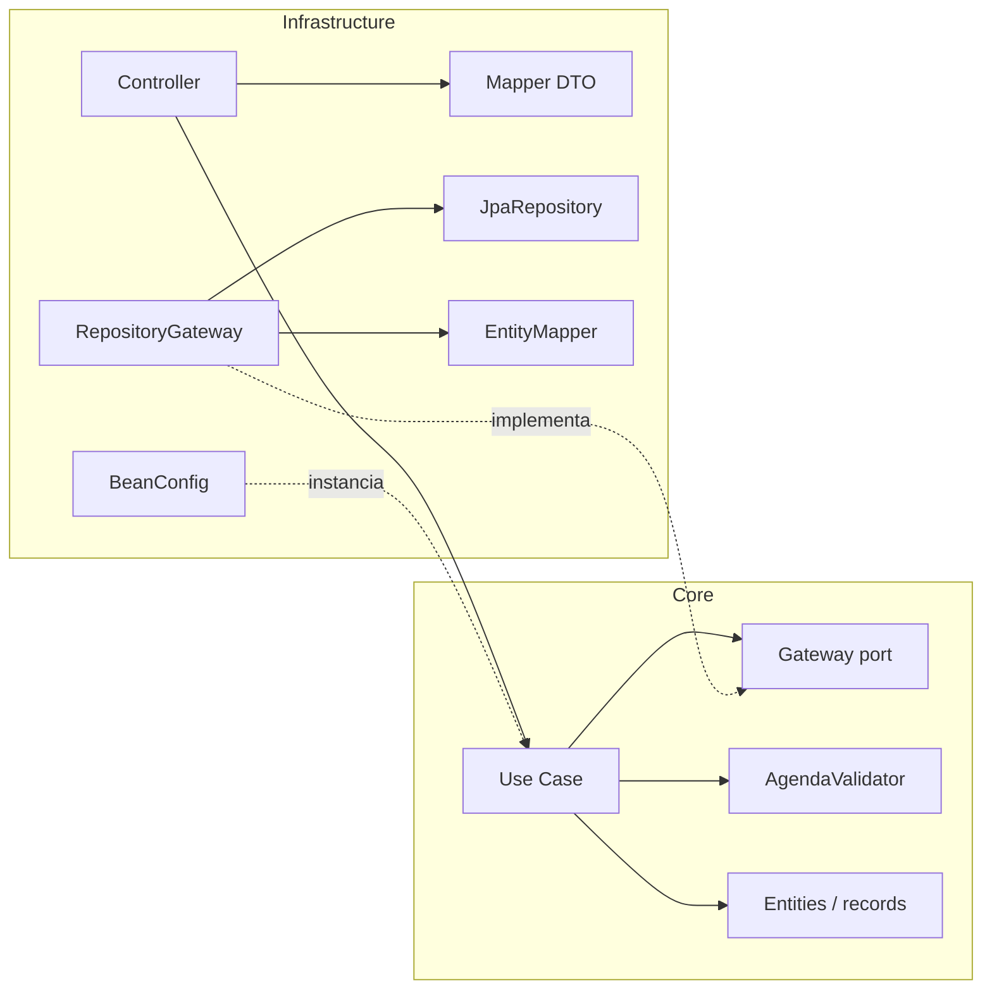
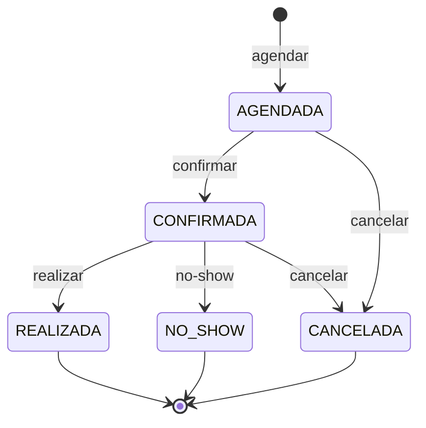
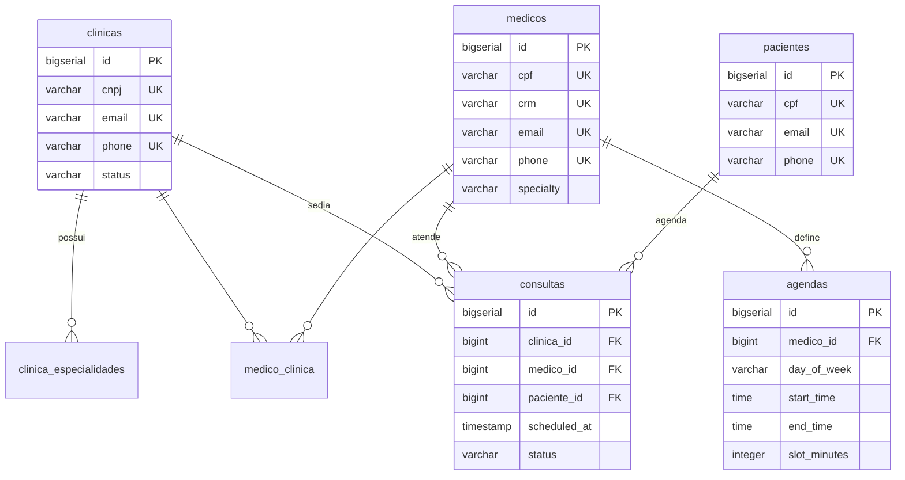

<div align="center">

# 🏥 ClinicFlow

**API REST para gestão de clínicas médicas, médicos, pacientes e consultas — construída com Clean Architecture.**

[](https://openjdk.org/projects/jdk/17/)
[](https://spring.io/projects/spring-boot)
[](https://www.postgresql.org/)
[](https://flywaydb.org/)
[](#testes)

</div>

O **ClinicFlow** centraliza o gerenciamento de uma rede de clínicas: cadastro de **clínicas**, **médicos** (com vínculo N:N a clínicas), **pacientes** e o **ciclo de vida completo de uma consulta** — do agendamento à realização, cancelamento ou no-show. As regras de negócio não triviais (agenda real do médico, conflito por slot, integridade sob concorrência) vivem isoladas de qualquer framework, seguindo **Clean Architecture** e **SOLID**.

> [!NOTE]
> Este é um projeto de **estudo/portfólio**. Autenticação, observabilidade e paginação ficaram **intencionalmente fora de escopo** — veja [Escopo & decisões](#escopo--decisões). O núcleo do domínio está completo e coberto por testes.

## Funcionalidades

- **Clínicas** — cadastro com CNPJ único e especialidades normalizadas.
- **Médicos** — CRUD completo, vínculo **N:N com clínicas** e validação de clínicas inexistentes.
- **Pacientes** — CRUD completo, com `404` tipado quando não encontrado.
- **Agenda do médico** — janelas de atendimento por dia da semana (`DoctorSchedule`) e cálculo de **slots livres** por data.
- **Consultas** — agendar, confirmar, reagendar, cancelar, realizar e registrar no-show, com:
  - validação da **agenda real** do médico (dia, janela e duração do slot);
  - conflito por **slot** (intervalo), não por instante exato;
  - validação do **vínculo médico↔clínica** e anti **double-booking** do paciente;
  - bloqueio de `realizar`/`no-show` **antes do horário** da consulta;
  - **unicidade do slot garantida no banco** via índice único parcial (proteção contra corrida/TOCTOU).
- **Transversal** — erros padronizados como `ProblemDetail` (RFC 7807) e schema versionado com Flyway (`ddl-auto: validate`).

## Arquitetura

O código é dividido em duas camadas, com a **regra de dependência sempre apontando para o domínio**:

- **`core`** — o domínio, **sem nenhuma dependência de framework** (sem Spring, sem JPA):
  - **entities** — modelos imutáveis (`record`): `Clinic`, `Doctor`, `Patient`, `Appointment`, `DoctorSchedule`;
  - **usecases** — regras de negócio, cada uma com **interface + implementação**;
  - **gateway (ports)** — contratos de persistência (`ClinicGateway`, `DoctorGateway`, `PatientGateway`, `AppointmentGateway`);
  - **services** — regras de domínio compartilhadas (`AgendaValidator`);
  - **exceptions / enums** — exceções de negócio tipadas e enums do domínio.
- **`infrastructure`** — os detalhes (adapters): controllers REST, implementações JPA dos ports, entidades `@Entity`, mappers, DTOs, `BeanConfig` (wiring) e o `GlobalExceptionHandler`.



O `core` **não conhece** a infraestrutura. A infraestrutura **implementa** os ports (`ClinicRepositoryGateway implements ClinicGateway`) e o `BeanConfig` instancia os use cases como `@Bean`, injetando os gateways por construtor — é onde a **Inversão de Dependência** se materializa.

| Princípio SOLID | Onde aparece |
|---|---|
| **S**ingle Responsibility | Cada use case faz uma única operação (`AgendarConsultaCaseImpl`, `DeletarPacienteCaseImpl`, …) |
| **O**pen/Closed | Novos comportamentos entram como novos use cases/adapters, sem tocar no core |
| **L**iskov | Qualquer implementação de um gateway substitui outra (um mock Mockito nos testes) |
| **I**nterface Segregation | Ports e use cases enxutos, segmentados por agregado e operação |
| **D**ependency Inversion | Use cases dependem das **interfaces** de gateway; o JPA fica na borda |

## Estrutura do projeto

```
src/main/java/dev/marcelo/clinicflow
├── ClinicFlowApplication.java
├── core/                         # Domínio (sem framework)
│   ├── entities/                 # Appointment, Clinic, Doctor, Patient, DoctorSchedule
│   ├── enums/                    # AppointmentStatus, ClinicStatus, DoctorSpecialty, Gender
│   ├── exceptions/               # Exceções de negócio tipadas
│   ├── gateway/                  # Ports: *Gateway
│   ├── services/                 # AgendaValidator (regras de agenda/slot)
│   └── usecases/                 # appointment / clinic / doctor / patient
└── infrastructure/               # Adapters e detalhes técnicos
    ├── beans/                    # BeanConfig (wiring dos use cases)
    ├── controller/               # Clinic, Doctor, Patient, Appointment controllers
    ├── dtos/                     # records de Request/Response
    ├── gateway/                  # implementações JPA dos ports
    ├── handler/                  # GlobalExceptionHandler (ProblemDetail)
    ├── mapper/                   # DTO ↔ domínio ↔ entidade JPA
    └── persistence/              # @Entity + JpaRepository

src/main/resources
├── application.yaml              # datasource, JPA (ddl-auto: validate), Flyway
└── db/migration/                 # V1..V7 — migrações Flyway versionadas
```

## Tecnologias

| Tecnologia | Versão | Uso |
|---|---|---|
| Java | 17 | Linguagem (records, streams) |
| Spring Boot | 4.0.6 | Web MVC, Data JPA, Actuator, DI |
| PostgreSQL | 16 | Banco relacional |
| Flyway | starter + `flyway-database-postgresql` | Versionamento do schema |
| Hibernate (via Spring Data JPA) | — | ORM em modo `validate` |
| Testcontainers | JUnit 5 + PostgreSQL | Testes de integração com banco real |
| JUnit 5 · Mockito · AssertJ | starters de teste | Testes unitários e de slice |
| Maven Wrapper | `./mvnw` | Build e dependências |

## Começando

### Pré-requisitos

- **Java 17+**
- **Docker** (para subir o PostgreSQL; também usado pelos testes de integração)

### 1. Clonar e subir o banco

```bash
git clone https://github.com/marcelopinotti/clinicflow.git
cd clinicflow
docker compose up -d        # PostgreSQL 16 em localhost:5431
```

O [`docker-compose.yml`](docker-compose.yml) provê um PostgreSQL com database `clinicflow` (usuário/senha `postgres`) e healthcheck.

### 2. Rodar a aplicação

```bash
./mvnw spring-boot:run      # Windows: mvnw.cmd spring-boot:run
```

As migrações Flyway são aplicadas no startup e a API sobe em **`http://localhost:8080`**.

### 3. Build do artefato

```bash
./mvnw clean package
java -jar target/ClinicFlow-0.0.1-SNAPSHOT.jar
```

> [!TIP]
> Para outro ambiente, sobrescreva o datasource por variáveis do Spring: `SPRING_DATASOURCE_URL`, `SPRING_DATASOURCE_USERNAME`, `SPRING_DATASOURCE_PASSWORD`.

### Explorando a API

O arquivo [`projeto_final.http`](projeto_final.http) (IntelliJ HTTP Client) executa o **fluxo completo de ponta a ponta** — cria clínica, médico, agenda, paciente e percorre todo o ciclo da consulta, com asserts. Abra-o e clique em *Run all requests in file*.

## Referência da API

Base URL: `http://localhost:8080` · Corpo: `application/json`

> [!IMPORTANT]
> Os enums trafegam pela sua **descrição em português**, não pelo nome da constante. Use os valores abaixo nos requests:
> | Enum | Valores aceitos |
> |---|---|
> | `gender` | `Masculino` · `Feminino` · `Outro` |
> | `specialty` / `specialties` | `Cardiologista` · `Dermatologista` · `Pediatra` · `Orthopedista` · `Neurologista` |
> | `dayOfWeek` | `MONDAY` … `SUNDAY` |
> | `status` (consulta) | `AGENDADA` · `CONFIRMADA` · `CANCELADA` · `REALIZADA` · `NO_SHOW` |
>
> Datas: `scheduledAt` no formato `yyyy-MM-dd HH:mm:ss`; horários (`startTime`/`endTime`) no formato `HH:mm:ss`.

### Clínicas — `/api/v1/clinicas`

| Método | Rota | Descrição | Sucesso | Erros |
|---|---|---|---|---|
| `POST` | `/criar` | Cadastra uma clínica | `201` | `409` CNPJ já cadastrado |

<details>
<summary>Exemplo</summary>

```jsonc
// POST /api/v1/clinicas/criar
{
  "name": "Clínica Saúde Total",
  "cnpj": "12.345.678/0001-90",
  "address": "Rua das Flores, 100",
  "phone": "+5511999998888",
  "email": "contato@saudetotal.com",
  "specialties": ["Cardiologista", "Pediatra"]
}
```
```jsonc
// 201 Created
{
  "id": 1,
  "name": "Clínica Saúde Total",
  "cnpj": "12.345.678/0001-90",
  "address": "Rua das Flores, 100",
  "phone": "+5511999998888",
  "email": "contato@saudetotal.com",
  "status": "ACTIVE",
  "specialties": ["Cardiologista", "Pediatra"]
}
```
</details>

### Médicos — `/api/v1/medicos`

| Método | Rota | Descrição | Sucesso | Erros |
|---|---|---|---|---|
| `POST` | `/criar` | Cadastra médico (com `clinicIds`) | `201` | `500`&nbsp;* clínica do vínculo inexistente |
| `GET` | `/listar` | Lista todos os médicos | `200` | — |
| `GET` | `/listar/{id}` | Busca médico por id | `200` | `500`&nbsp;* não encontrado |
| `PUT` | `/atualizar/{id}` | Atualiza um médico | `200` | `500`&nbsp;* não encontrado |
| `DELETE` | `/deletar/{id}` | Remove um médico | `200` | `500`&nbsp;* não encontrado |
| `POST` | `/{id}/agenda/criar` | Cria janela de atendimento | `201` | `409` janela sobreposta · `400` janela inválida |
| `GET` | `/{id}/agenda/listar` | Lista as janelas do médico | `200` | — |
| `DELETE` | `/{id}/agenda/deletar/{agendaId}` | Remove uma janela | `200` | `500`&nbsp;* não encontrado |
| `GET` | `/{id}/agenda/livres?data=YYYY-MM-DD` | Slots livres na data | `200` | — |

> [!NOTE]
> `*` Os endpoints de **médico** ainda sinalizam "não encontrado" / "clínica inexistente" com `RuntimeException` genérica, que cai no `500`. **Pacientes** e **consultas** já usam exceções tipadas (`*NotFoundException` → `404`) — uniformizar o médico é a rough edge conhecida do projeto.

<details>
<summary>Exemplos</summary>

```jsonc
// POST /api/v1/medicos/criar
{
  "firstName": "Ana",
  "lastName": "Souza",
  "cpf": "123.456.789-00",
  "email": "ana.souza@clinica.com",
  "address": "Av. Paulista, 1000",
  "phone": "+5511988887777",
  "age": 38,
  "crm": "CRM123456",
  "gender": "Feminino",
  "specialty": "Cardiologista",
  "clinicIds": [1]
}
```
```jsonc
// POST /api/v1/medicos/1/agenda/criar  -> segunda, 09:00–12:00, slots de 30min
{ "dayOfWeek": "MONDAY", "startTime": "09:00:00", "endTime": "12:00:00", "slotMinutes": 30 }
```
```jsonc
// GET /api/v1/medicos/1/agenda/livres?data=2026-06-29  -> 6 slots
[ { "horario": "09:00:00" }, { "horario": "09:30:00" }, { "horario": "10:00:00" },
  { "horario": "10:30:00" }, { "horario": "11:00:00" }, { "horario": "11:30:00" } ]
```
</details>

### Pacientes — `/api/v1/patient`

| Método | Rota | Descrição | Sucesso | Erros |
|---|---|---|---|---|
| `POST` | `/criar` | Cadastra um paciente | `201` | — |
| `GET` | `/listar` | Lista todos os pacientes | `200` | — |
| `GET` | `/listar/{id}` | Busca paciente por id | `200` | `404` |
| `PUT` | `/atualizar/{id}` | Atualiza um paciente | `200` | `404` |
| `DELETE` | `/deletar/{id}` | Remove um paciente | `200` | `404` |

### Consultas — `/api/v1/consultas`

| Método | Rota | Descrição | Sucesso | Erros |
|---|---|---|---|---|
| `POST` | `` | Agenda uma consulta | `201` | `409` · `404` · `400` |
| `GET` | `/{id}` | Busca consulta por id | `200` | `404` |
| `GET` | `?medicoId=&pacienteId=` | Lista por médico **ou** paciente | `200` | — |
| `PATCH` | `/{id}/confirmar` | Confirma a consulta | `200` | `409` · `404` |
| `PATCH` | `/{id}/reagendar` | Reagenda (revalida a agenda) | `200` | `409` · `404` |
| `PATCH` | `/{id}/cancelar` | Cancela a consulta | `200` | `409` · `404` |
| `PATCH` | `/{id}/realizar` | Marca como realizada | `200` | `409` · `404` |
| `PATCH` | `/{id}/no-show` | Registra no-show | `200` | `409` · `404` |

<details>
<summary>Exemplos</summary>

```jsonc
// POST /api/v1/consultas
{ "clinicId": 1, "doctorId": 1, "patientId": 1, "scheduledAt": "2026-06-29 09:00:00" }
```
```jsonc
// 201 Created
{ "id": 1, "clinicId": 1, "doctorId": 1, "patientId": 1,
  "scheduledAt": "2026-06-29 09:00:00", "status": "AGENDADA" }
```
```jsonc
// PATCH /api/v1/consultas/1/reagendar
{ "scheduledAt": "2026-06-29 10:00:00" }
```
```jsonc
// 409 Conflict (ProblemDetail) — slot já ocupado
{ "type": "about:blank", "title": "Conflito na operação da consulta",
  "status": 409, "detail": "O médico 1 já possui uma consulta ativa no horário 2026-06-29T09:00" }
```
</details>

### Tratamento de erros

Exceções de negócio do `core` são traduzidas em `ProblemDetail` (RFC 7807) pelo `GlobalExceptionHandler`:

| HTTP | Quando |
|---|---|
| `400 Bad Request` | data de consulta inválida, janela de agenda inválida, corpo/enum ilegível |
| `404 Not Found` | clínica, médico ou paciente referenciado por uma consulta inexistente, e paciente no seu CRUD — via exceções tipadas (`*NotFoundException`) |
| `409 Conflict` | CNPJ/CRM/CPF duplicado, slot ocupado, fora da agenda, médico não vinculado à clínica, transição de status inválida, consulta ainda não ocorrida, **violação de integridade do banco** (rede de segurança da unicidade de slot) |
| `500` | "não encontrado" nos endpoints de **médico** (ainda usa `RuntimeException` genérica — ver nota acima) |

## Regras de negócio das consultas

O ciclo de vida da consulta e suas transições válidas:



Ao **agendar** ou **reagendar**, o `AgendaValidator` garante que o horário cai numa janela real do médico, alinhado à duração do slot, sem conflito com outra consulta ativa, com o médico vinculado à clínica e sem double-booking do paciente. `realizar` e `no-show` só são aceitos **após** o horário da consulta. Por fim, a unicidade `(médico, horário)` para consultas ativas é garantida **no banco** por um índice único parcial — duas requisições concorrentes para o mesmo slot não conseguem ambas gravar.

## Banco de dados

PostgreSQL com schema gerenciado **exclusivamente pelo Flyway** — o Hibernate roda em `ddl-auto: validate` (apenas valida, nunca altera).



| Migração | Descrição |
|---|---|
| `V1` | Tabelas `clinicas`, `medicos`, `pacientes`, `consultas` |
| `V2` | Colunas obrigatórias (`NOT NULL`) |
| `V3` | `cnpj` único em `clinicas` |
| `V4` | Especialidades da clínica em tabela normalizada `clinica_especialidades` |
| `V5` | Tabela de junção `medico_clinica` (N:N) |
| `V6` | Tabela `agendas` (janelas de atendimento do médico) |
| `V7` | Índice único **parcial** de slot do médico — `(medico_id, scheduled_at) WHERE status <> 'CANCELADA'` |

> [!NOTE]
> O índice de `V7` é **parcial** de propósito: consultas `CANCELADA` ficam de fora, de modo que cancelar uma consulta **libera o slot** para reuso, sem abrir brecha para double-booking entre as ativas.

## Testes

```bash
./mvnw test      # testes unitários (rápidos, sem banco)
./mvnw verify    # unitários + integração (Testcontainers — requer Docker)
```

- **Unitários** — use cases, gateways e controllers (`@WebMvcTest`) com Mockito + AssertJ, sem subir banco. Validam regras isoladamente (ex.: agendar **não persiste** quando o slot está ocupado).
- **Integração** — `ClinicFlowEndToEndIT` exercita a stack real (controller → use case → gateway → JPA/Hibernate → Flyway) contra um **PostgreSQL efêmero via Testcontainers**, incluindo um teste de **agendamento concorrente** que prova a unicidade de slot no banco (um `201`, os demais `409`).

Cobertura atual: **113 testes unitários + 5 de integração**, todos verdes.

## Escopo & decisões

O ClinicFlow é um projeto de **estudo/portfólio** com um objetivo claro: aplicar **Clean Architecture** e **SOLID** num domínio real, com regras de negócio não triviais e cobertura de testes. Esse objetivo foi atingido e o **núcleo do domínio está fechado**.

Os itens abaixo ficaram **intencionalmente fora de escopo** — não são lacunas esquecidas, e sim uma fronteira consciente, por não acrescentarem ao recado arquitetural do projeto:

- **Autenticação/Autorização** (Spring Security, JWT, OAuth2): seria infraestrutura transversal sem demonstrar Clean Architecture/SOLID além do que o domínio já demonstra.
- **Observabilidade** (métricas, tracing, logs estruturados) e **OpenAPI/Swagger**.
- **Paginação e filtros** nas listagens.

> [!NOTE]
> Caso o projeto evoluísse para produção, esses itens deixariam de ser "fora de escopo" e passariam a ser requisitos não-funcionais — outra camada de "necessário" que o domínio sozinho não cobre. A integridade tratada aqui é a **do domínio** (transições válidas, agenda, unicidade de slot), não a de autenticação.
