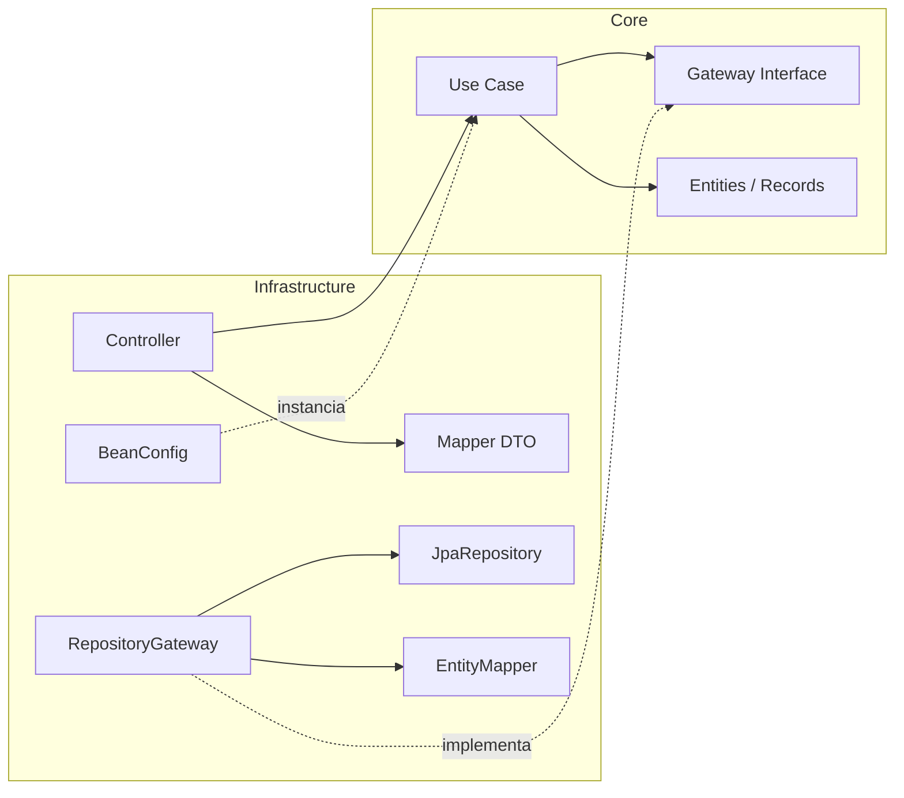
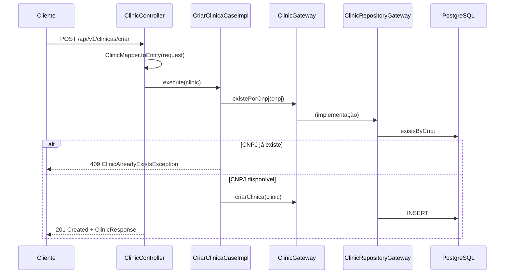

# 🏥 ClinicFlow

API REST para gestão de clínicas médicas, construída com **Java 17**, **Spring Boot 4** e **Clean Architecture**.

O ClinicFlow centraliza o gerenciamento de **clínicas**, **médicos**, **pacientes** e **consultas**, resolvendo o problema de controle descentralizado de cadastros e agendamentos em redes de clínicas — incluindo o vínculo N:N entre médicos e clínicas e o ciclo de vida completo de uma consulta (agendada → confirmada → realizada / cancelada / no-show).

> [!NOTE]
> O domínio de **consultas (appointments)** já possui entidades, contratos de use cases e estrutura de persistência criados, porém suas implementações estão **em desenvolvimento** (ver [Roadmap](#-roadmap)).

---

## 📐 Arquitetura

O projeto segue **Clean Architecture**, separando o código em duas camadas principais com a regra de dependência apontando sempre para o domínio:

- **`core`** — o coração da aplicação. Não possui **nenhuma dependência de framework** (sem Spring, sem JPA). Contém:
  - **Entities**: modelos de domínio imutáveis (`record`s Java) — `Clinic`, `Doctor`, `Patient`, `Appointment`;
  - **Use Cases**: regras de negócio, cada um com **interface + implementação** (ex.: `CriarClinicaCase` / `CriarClinicaCaseImpl`);
  - **Gateways (Ports)**: interfaces que definem os contratos de persistência (`ClinicGateway`, `DoctorGateway`, `PatientGateway`, `AppointmentGateway`);
  - **Exceptions**: exceções de negócio (`ClinicAlreadyExistsException`, `PatientNotFoundException`);
  - **Enums**: `AppointmentStatus`, `ClinicStatus`, `DoctorSpecialty`, `Gender`.

- **`infrastructure`** — detalhes de implementação (Adapters):
  - **Controllers**: pontos de entrada REST (`ClinicController`, `DoctorController`, `PatientController`);
  - **Gateways (Adapters)**: implementações dos ports do core usando Spring Data JPA (`ClinicRepositoryGateway`, etc.);
  - **Persistence**: entidades JPA (`@Entity`) e repositórios (`JpaRepository`) — separadas das entidades de domínio;
  - **Mappers**: conversão entre DTO ↔ domínio (`ClinicMapper`) e domínio ↔ JPA (`ClinicEntityMapper`);
  - **DTOs**: `record`s de request/response da API;
  - **Beans**: `BeanConfig` instancia manualmente os use cases como `@Bean`, injetando os gateways — é aqui que a **Inversão de Dependência** se materializa;
  - **Handler**: `GlobalExceptionHandler` (`@RestControllerAdvice`) traduz exceções de negócio em respostas HTTP com `ProblemDetail` (RFC 7807).

### Fluxo de dependências



O `core` **não conhece** a infraestrutura. A infraestrutura **implementa** os contratos do core (`ClinicRepositoryGateway implements ClinicGateway`) e o Spring conecta tudo via `BeanConfig`.

### Fluxo de uma requisição (ex.: criar clínica)



### SOLID aplicado

| Princípio | Onde aparece |
|---|---|
| **S** — Single Responsibility | Cada use case faz uma única operação (`CriarMedicoCaseImpl`, `DeletarPacienteCaseImpl`...) |
| **O** — Open/Closed | Novos comportamentos entram como novos use cases/adapters, sem alterar o core |
| **L** — Liskov Substitution | Qualquer implementação de `ClinicGateway` substitui outra (em testes, um mock Mockito) |
| **I** — Interface Segregation | Gateways e use cases por agregado, com contratos enxutos por operação |
| **D** — Dependency Inversion | Use cases dependem das **interfaces** de gateway; as implementações JPA ficam na infraestrutura |

---

## 📁 Estrutura do Projeto

```
src/main/java/dev/marcelo/clinicflow
├── ClinicFlowApplication.java          # Entry point Spring Boot
├── core/                               # ── Domínio (sem dependências de framework)
│   ├── entities/                       # Records imutáveis: Appointment, Clinic, Doctor, Patient
│   ├── enums/                          # AppointmentStatus, ClinicStatus, DoctorSpecialty, Gender
│   ├── exceptions/                     # ClinicAlreadyExistsException, PatientNotFoundException
│   ├── gateway/                        # Ports: AppointmentGateway, ClinicGateway, DoctorGateway, PatientGateway
│   └── usecases/
│       ├── appointment/                # Agendar, Buscar, Cancelar, Confirmar, Realizar,
│       │                               # RegistrarNoShow, ListarPorMedico, ListarPorPaciente
│       ├── clinic/                     # Criar, Atualizar, Buscar, Deletar, Listar
│       ├── doctor/                     # Criar, Atualizar, Buscar, Deletar, Listar
│       └── patient/                    # Criar, Atualizar, Buscar, Deletar, Listar
└── infrastructure/                     # ── Adapters e detalhes técnicos
    ├── beans/                          # BeanConfig: wiring dos use cases
    ├── controller/                     # ClinicController, DoctorController, PatientController
    ├── dtos/                           # Records de Request/Response por agregado
    ├── gateway/                        # Implementações JPA dos ports do core
    ├── handler/                        # GlobalExceptionHandler (ProblemDetail)
    ├── mapper/                         # DTO ↔ domínio e domínio ↔ entidade JPA
    └── persistence/                    # Entidades @Entity e repositórios JpaRepository

src/main/resources
├── application.yaml                    # Datasource, JPA (ddl-auto: validate), Flyway
└── db/migration/                       # V1..V5 — migrações Flyway versionadas
```

---

## 🛠️ Tecnologias Utilizadas

| Tecnologia | Versão | Finalidade |
|---|---|---|
| Java | 17 | Linguagem principal (records, streams) |
| Spring Boot | 4.0.6 | Framework base, autoconfiguração e DI |
| Spring Web MVC | starter | API REST |
| Spring Data JPA | starter | Persistência ORM (Hibernate) |
| PostgreSQL | runtime driver | Banco de dados relacional |
| Flyway | starter + `flyway-database-postgresql` | Versionamento do schema (migrations) |
| Kotlin (stdlib) | 2.2.20 | Stdlib e plugin Maven configurados no build |
| JUnit 5 + Mockito + AssertJ | via starters de teste | Testes unitários e de contexto |
| Maven (wrapper) | `mvnw` | Build e gerenciamento de dependências |

---

## ✅ Funcionalidades

### Clínicas
- [x] Cadastrar clínica com validação de **CNPJ duplicado** (regra de negócio no use case)
- [x] Especialidades da clínica normalizadas em tabela própria (`@ElementCollection`)
- [ ] Listar, buscar, atualizar e deletar clínica *(contratos criados, implementação pendente)*

### Médicos
- [x] CRUD completo (criar, listar, buscar por id, atualizar, deletar)
- [x] Vínculo **N:N com clínicas** (`medico_clinica`), com validação de clínicas inexistentes
- [x] Especialidade e gênero como enums persistidos por nome

### Pacientes
- [x] CRUD completo (criar, listar, buscar por id, atualizar, deletar)
- [x] Erro `404` padronizado via `PatientNotFoundException`

### Consultas
- [ ] Agendar, confirmar, cancelar, realizar, registrar no-show *(use cases e schema prontos, implementação pendente)*
- [ ] Listar consultas por médico e por paciente

### Transversal
- [x] Tratamento global de exceções com **`ProblemDetail` (RFC 7807)**
- [x] Migrações de banco versionadas com **Flyway** (`ddl-auto: validate`)

---

## 🔄 Casos de Uso

Todos os use cases seguem o mesmo padrão: **interface** (contrato) + **implementação** que recebe o gateway por construtor.

### Clínica

| Use Case | Entrada | Saída | Fluxo | Status |
|---|---|---|---|---|
| `CriarClinicaCase` | `Clinic` | `Clinic` criada | Verifica `existePorCnpj`; se já existe lança `ClinicAlreadyExistsException` (HTTP 409); senão persiste via `ClinicGateway.criarClinica` | ✅ |
| `BuscarClinicaCase` | `Long id` | `Clinic` | — | 🚧 stub |
| `ListarClinicasCase` | — | `List<Clinic>` | — | 🚧 stub |
| `AtualizarClinicaCase` | `Clinic` | `Clinic` | — | 🚧 stub |
| `DeletarClinicaCase` | `Long id` | `void` | — | 🚧 stub |

### Médico

| Use Case | Entrada | Saída | Fluxo |
|---|---|---|---|
| `CriarMedicoCase` | `Doctor` | `Doctor` | Delega ao `DoctorGateway`, que resolve os `clinicIds` em entidades (falha se alguma clínica não existir) e persiste |
| `ListarMedicosCase` | — | `List<Doctor>` | `findAll` mapeado para domínio |
| `BuscarMedicoCase` | `Long id` | `Optional<Doctor>` | `findById` mapeado; controller lança erro se vazio |
| `AtualizarMedicoCase` | `Long id`, `Doctor` | `Doctor` | Busca o existente, preserva o `id`, aplica os novos dados e persiste; lança erro se não encontrado |
| `DeletarMedicoCase` | `Long id` | `void` | Busca e deleta; lança erro se não encontrado |

### Paciente

Mesmo padrão do médico (`Criar`, `Listar`, `Buscar`, `Atualizar`, `Deletar`), com a diferença de usar a exceção tipada `PatientNotFoundException` → HTTP 404.

### Consulta (🚧 em desenvolvimento)

Contratos definidos: `AgendarConsultaCase`, `ConfirmarConsultaCase`, `CancelarConsultaCase`, `RealizarConsultaCase`, `RegistrarNoShowCase`, `BuscarConsultaCase`, `ListarConsultasPorMedicoCase`, `ListarConsultasPorPacienteCase`. As implementações existem como stubs e o `AppointmentGateway` ainda não expõe operações.

---

## 🌐 Endpoints

Base URL: `http://localhost:8080`

### Clínicas — `/api/v1/clinicas`

| Método | URL | Descrição | Sucesso | Erros |
|---|---|---|---|---|
| `POST` | `/api/v1/clinicas/criar` | Cadastra uma clínica | `201` + `ClinicResponse` | `409` CNPJ já cadastrado |

<details>
<summary>Exemplo de request/response</summary>

```json
// POST /api/v1/clinicas/criar
{
  "name": "Clínica Saúde Total",
  "cnpj": "12.345.678/0001-90",
  "address": "Rua das Flores, 100",
  "phone": "11999998888",
  "email": "contato@saudetotal.com",
  "specialties": ["CARDIOLOGY", "PEDIATRICS"]
}
```

```json
// 201 Created
{
  "id": 1,
  "name": "Clínica Saúde Total",
  "cnpj": "12.345.678/0001-90",
  "address": "Rua das Flores, 100",
  "phone": "11999998888",
  "email": "contato@saudetotal.com",
  "status": null,
  "specialties": ["CARDIOLOGY", "PEDIATRICS"]
}
```

```json
// 409 Conflict (ProblemDetail)
{
  "type": "about:blank",
  "title": "Clínica já cadastrada",
  "status": 409,
  "detail": "Já existe uma clínica cadastrada com o CNPJ: 12.345.678/0001-90"
}
```
</details>

### Médicos — `/api/v1/doctor`

| Método | URL | Descrição | Sucesso | Erros |
|---|---|---|---|---|
| `POST` | `/api/v1/doctor/criar` | Cadastra um médico (com `clinicIds` opcionais) | `200` + `DoctorResponse` | `500` se alguma clínica informada não existir |
| `GET` | `/api/v1/doctor/listar` | Lista todos os médicos | `200` + `List<DoctorResponse>` | — |
| `GET` | `/api/v1/doctor/listar/{id}` | Busca médico por id | `200` + `DoctorResponse` | `500` "Doctor not found" |
| `PUT` | `/api/v1/doctor/atualizar/{id}` | Atualiza um médico | `200` + `DoctorResponse` | `500` se não encontrado |
| `DELETE` | `/api/v1/doctor/deletar/{id}` | Remove um médico | `200` | `500` se não encontrado |

<details>
<summary>Exemplo de request</summary>

```json
// POST /api/v1/doctor/criar
{
  "firstName": "Ana",
  "lastName": "Souza",
  "cpf": "123.456.789-00",
  "email": "ana.souza@clinica.com",
  "address": "Av. Paulista, 1000",
  "phone": "11988887777",
  "age": 38,
  "crm": "CRM-SP 123456",
  "gender": "FEMALE",
  "specialty": "CARDIOLOGY",
  "clinicIds": [1]
}
```
</details>

### Pacientes — `/api/v1/patient`

| Método | URL | Descrição | Sucesso | Erros |
|---|---|---|---|---|
| `POST` | `/api/v1/patient/criar` | Cadastra um paciente | `201` + `PatientResponse` | — |
| `GET` | `/api/v1/patient/listar` | Lista todos os pacientes | `200` + `List<PatientResponse>` | — |
| `GET` | `/api/v1/patient/listar/{id}` | Busca paciente por id | `200` + `PatientResponse` | `404` paciente não encontrado |
| `PUT` | `/api/v1/patient/atualizar/{id}` | Atualiza um paciente | `200` + `PatientResponse` | `404` paciente não encontrado |
| `DELETE` | `/api/v1/patient/deletar/{id}` | Remove um paciente | `200` | `404` paciente não encontrado |

---

## 🗄️ Banco de Dados

PostgreSQL com schema gerenciado **exclusivamente pelo Flyway** (`spring.jpa.hibernate.ddl-auto: validate` — o Hibernate apenas valida, nunca altera).

```mermaid
erDiagram
    clinicas ||--o{ clinica_especialidades : "possui"
    clinicas ||--o{ medico_clinica : ""
    medicos  ||--o{ medico_clinica : ""
    clinicas ||--o{ consultas : "sedia"
    medicos  ||--o{ consultas : "atende"
    pacientes||--o{ consultas : "agenda"

    clinicas {
        bigserial id PK
        varchar name
        varchar cnpj UK
        varchar address
        varchar phone UK
        varchar email UK
        varchar status
    }
    clinica_especialidades {
        bigint clinica_id PK_FK
        varchar especialidade PK
    }
    medicos {
        bigserial id PK
        varchar first_name
        varchar last_name
        varchar cpf UK
        varchar email UK
        varchar address
        varchar phone UK
        integer age
        varchar crm UK
        varchar gender
        varchar specialty
    }
    medico_clinica {
        bigint medico_id PK_FK
        bigint clinica_id PK_FK
    }
    pacientes {
        bigserial id PK
        varchar first_name
        varchar last_name
        varchar cpf UK
        varchar email UK
        varchar address
        varchar phone UK
        integer age
        varchar gender
    }
    consultas {
        bigserial id PK
        bigint clinica_id FK
        bigint medico_id FK
        bigint paciente_id FK
        timestamp scheduled_at
        varchar status
    }
```

**Relacionamentos e estratégias:**

- `medicos ↔ clinicas`: **N:N** via `medico_clinica` (`@ManyToMany`, fetch EAGER);
- `clinicas → clinica_especialidades`: coleção de enums normalizada (`@ElementCollection`);
- `consultas`: **N:1** para clínica, médico e paciente (`@ManyToOne`, FKs `NOT NULL`);
- Enums persistidos como `STRING` (`@Enumerated(EnumType.STRING)`);
- Chaves primárias `BIGSERIAL` com `GenerationType.IDENTITY`;
- Unicidade garantida no banco: `cnpj`, `cpf`, `crm`, `email`, `phone`.

**Migrações (`src/main/resources/db/migration`):**

| Versão | Descrição |
|---|---|
| `V1` | Criação das tabelas `clinicas`, `medicos`, `pacientes`, `consultas` |
| `V2` | Colunas obrigatórias (`NOT NULL`) em endereços, idade e especialidades |
| `V3` | Adição de `cnpj` único em `clinicas` |
| `V4` | Especialidades da clínica movidas para tabela normalizada `clinica_especialidades` |
| `V5` | Tabela de junção `medico_clinica` (relacionamento N:N) |

---

## 🔒 Segurança

O projeto **ainda não possui** camada de segurança (Spring Security, JWT, OAuth2, roles ou filtros). Autenticação e autorização estão previstas no [Roadmap](#-roadmap).

---

## 📦 Dependências

| Dependência | Finalidade |
|---|---|
| `spring-boot-starter-webmvc` | Servidor web embarcado + Spring MVC para a API REST |
| `spring-boot-starter-data-jpa` | Hibernate + Spring Data (repositórios `JpaRepository`) |
| `spring-boot-starter-flyway` + `flyway-database-postgresql` | Execução automática das migrações no startup |
| `postgresql` (runtime) | Driver JDBC do PostgreSQL |
| `kotlin-stdlib-jdk8` + `kotlin-maven-plugin` | Suporte a Kotlin no build (stdlib disponível no classpath) |
| `spring-boot-starter-data-jpa-test`, `spring-boot-starter-flyway-test`, `spring-boot-starter-webmvc-test`, `kotlin-test` (test) | JUnit 5, Mockito, AssertJ e slices de teste do Spring |

---

## 🚀 Execução

### Pré-requisitos

- **Java 17+**
- **PostgreSQL** rodando em `localhost:5431` com database `clinicflow`
- (Opcional) Docker para subir o banco

### Banco de dados

```bash
docker run -d --name clinicflow-db \
  -e POSTGRES_DB=clinicflow \
  -e POSTGRES_USER=postgres \
  -e POSTGRES_PASSWORD=postgres \
  -p 5431:5432 \
  postgres:16
```

### Configuração

As configurações ficam em [`src/main/resources/application.yaml`](src/main/resources/application.yaml):

| Propriedade | Valor padrão |
|---|---|
| `spring.datasource.url` | `jdbc:postgresql://localhost:5431/clinicflow` |
| `spring.datasource.username` / `password` | `postgres` / `postgres` |
| `spring.jpa.hibernate.ddl-auto` | `validate` |
| `spring.flyway.enabled` | `true` |

> [!TIP]
> Para outro ambiente, sobrescreva via variáveis do Spring, ex.: `SPRING_DATASOURCE_URL`, `SPRING_DATASOURCE_USERNAME`, `SPRING_DATASOURCE_PASSWORD`.

### Rodando localmente

```bash
# Linux/macOS
./mvnw spring-boot:run

# Windows
mvnw.cmd spring-boot:run
```

As migrações Flyway são aplicadas automaticamente no startup. A API sobe em `http://localhost:8080`.

### Build

```bash
./mvnw clean package
java -jar target/ClinicFlow-0.0.1-SNAPSHOT.jar
```

---

## 🧪 Testes

```bash
./mvnw test
```

Estratégia atual:

- **Testes unitários de use case** com **Mockito + AssertJ**, sem subir o contexto Spring — o gateway é mockado, validando a regra de negócio isoladamente:
  - `CriarClinicaCaseImplTest`: cria clínica quando o CNPJ não existe; lança `ClinicAlreadyExistsException` **sem persistir** quando o CNPJ já existe (`verify(..., never())`).
- **Teste de contexto** (`ClinicFlowApplicationTests`): valida o carregamento da aplicação.

A arquitetura facilita a expansão: como os use cases dependem só de interfaces, todos são testáveis sem banco e sem Spring.

---

## ✨ Boas Práticas Implementadas

- **Clean Architecture** — domínio isolado de framework; infraestrutura como detalhe substituível;
- **Inversão de Dependência** — use cases dependem de ports (`*Gateway`), implementados na borda;
- **Injeção de Dependência via construtor** — sem field injection; use cases instanciados explicitamente em `BeanConfig`;
- **Imutabilidade** — entidades de domínio e DTOs como `record`s Java; atualizações criam novas instâncias;
- **Separação de responsabilidades** — modelo de domínio ≠ entidade JPA ≠ DTO, com mappers dedicados para cada fronteira;
- **Tratamento de exceções centralizado** — exceções de negócio tipadas no core, traduzidas para `ProblemDetail` (RFC 7807) no `GlobalExceptionHandler`;
- **Schema como código** — Flyway com `ddl-auto: validate`, garantindo que o banco evolua apenas por migração versionada;
- **Integridade no banco** — constraints `UNIQUE`/`NOT NULL`/FKs declaradas nas migrações, não apenas na aplicação.

---

## 🗺️ Roadmap

- [ ] Implementar o módulo de **consultas**: agendar, confirmar, cancelar, realizar, registrar no-show, listagens por médico/paciente + `AppointmentController`;
- [ ] Completar o CRUD de **clínicas** (buscar, listar, atualizar, deletar) e registrar os beans correspondentes;
- [ ] Substituir `RuntimeException` genéricas por exceções tipadas (`DoctorNotFoundException`, `ClinicNotFoundException`) com handlers dedicados;
- [ ] Validação de entrada com **Bean Validation** (`@Valid`, `@NotBlank`, CPF/CNPJ);
- [ ] **Spring Security** com autenticação JWT e perfis de acesso;
- [ ] Documentação interativa com **OpenAPI/Swagger**;
- [ ] Testes de integração com **Testcontainers** (PostgreSQL real);
- [ ] Paginação e filtros nas listagens;
- [ ] Padronizar status HTTP (ex.: `204 No Content` em deleções).

---

## 🤝 Contribuição

1. Faça um *fork* do projeto;
2. Crie uma branch a partir da `main`: `git checkout -b feature/minha-feature`;
3. Siga o padrão arquitetural existente (use case com interface + impl no `core`, adapter na `infrastructure`, bean registrado no `BeanConfig`);
4. Adicione testes unitários para novas regras de negócio;
5. Abra um *Pull Request* descrevendo a mudança.

---

## 📄 Licença

Este projeto ainda não possui uma licença definida. Até lá, todos os direitos são reservados ao autor.

---

## 👨‍💻 Autor

<a href="https://github.com/marcelopinotti">
  
</a>

### Marcelo Pinotti

GitHub:
https://github.com/marcelopinotti
